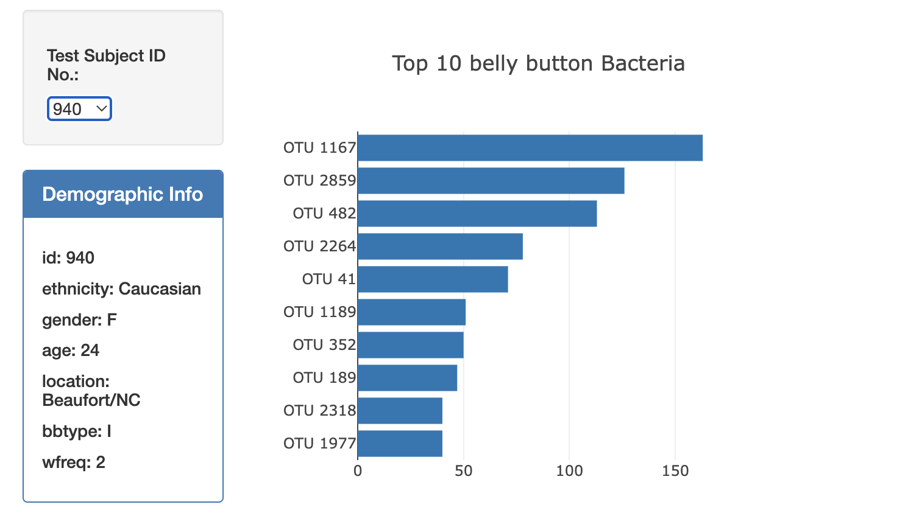
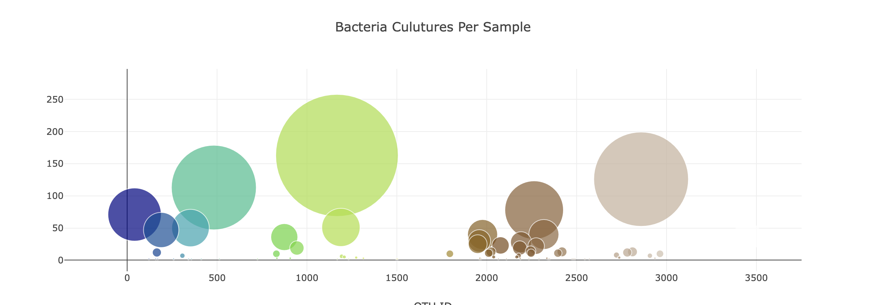
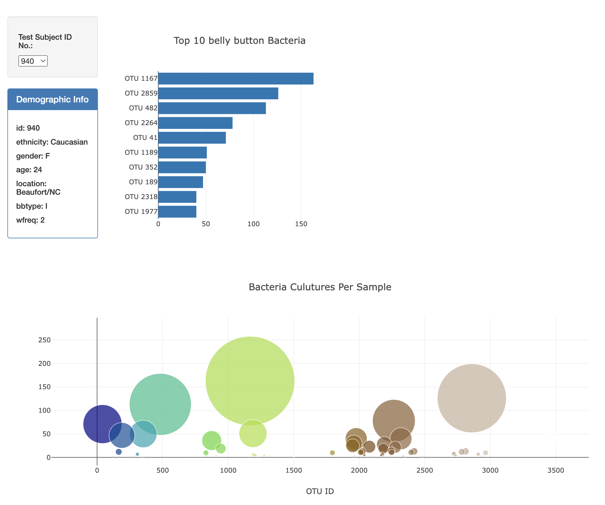

# Unit 14 Homework: Belly Button Biodiversity

What we did:

1. Used D3 library to explore `samples.json` file which we had from the URL `https://2u-data-curriculum-team.s3.amazonaws.com/dataviz-classroom/v1.1/14-Interactive-Web-Visualizations/02-Homework/samples.json`.

2. Created a bar chart with a dropdown menu to show the top 10 OTUs.

3. Created a bubble chart to show each sample.

4. Displayed the sample metadata.

5. Displayed each key-value.

6. Updated all the plots to the new samples selected.

